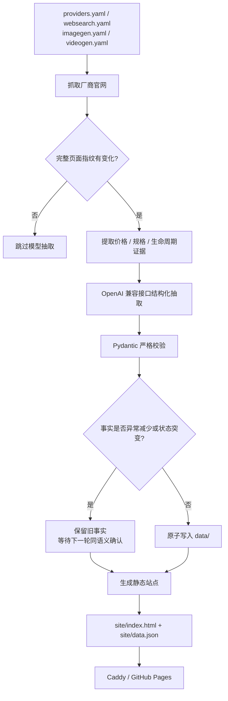

# 大模型价格看板（LLM Price Watch）

[](https://model-price.minggemini3test1.online/)
[](https://github.com/haverainlilili/model--price/actions/workflows/update.yml)


一个面向大模型开发者和采购决策者的**官网事实聚合与价格比较站**。项目自动抓取厂商第一方页面，结构化整理 API 价格、订阅套餐与额度、联网搜索、AI 生图、AI 生视频、生命周期和官方公告，并生成无需前端框架的静态网站。

> **在线访问：** <https://model-price.minggemini3test1.online/>
>
> 本项目只展示可核对的客观事实，不做模型质量、画质或视频效果的主观评分。

## 功能总览

| 模块 | 主要内容 | 当前覆盖 |
|---|---|---:|
| **API 价格** | 输入、输出、缓存 Token 价格，活动与价格变动 | 11 家模型厂商 |
| **套餐与额度** | 官网套餐价格、刷新周期、明示额度、支持模型 | 主流公开套餐 |
| **联网搜索** | 模型内置搜索、AI/RAG Search API、SERP API | 25 家产品/厂商 |
| **AI 生图** | API 状态、单张价格、模式、分辨率、格式、免费额度、官方样例 | 16 家厂商 |
| **AI 生视频** | API 状态、每秒价格、模式、分辨率、时长、帧率、原生音频、官方样例 | 18 家厂商 |

站点还提供：

- 国际价区／中国价区筛选；这里表示**服务端点或官方价格区域**，不是公司注册地。
- 原币价格与人民币折算切换（媒体生成的严格柱图保留原币，不跨币种比较）。
- 价格变化流水、官方公告与产品生命周期提示。
- URL Hash 深链接、键盘导航和移动端横向样例画廊。
- 原始结构化数据：<https://model-price.minggemini3test1.online/data.json>。

## 项目原则

### 1. 只使用第一方来源

价格、能力、额度、限制、停用日期和样例入口均来自厂商官网、官方文档或厂商官方托管页面。

- 不使用 Fal、Replicate、Together 等第三方聚合平台价格代替厂商官方价格。
- 不将订阅价格机械折算为 API 单价。
- 不导入社区实测额度、排行榜分数或主观评价。
- 官方社区作品会明确标注为“官方托管社区作品”，不会伪装成厂商精选样例。
- 媒体来源配置有域名白名单；HTTP 和浏览器渲染后的最终跳转地址也会重新校验。

### 2. 严格控制“可比价格”

只有计费单位和关键规格一致的项目才会进入价格柱状图；其余项目仍保留在事实表中。

#### AI 生图

按以下基础口径分组：

- 原始币种：USD / CNY；
- 质量档：Standard / Premium；
- 输出尺寸：约 0.8–1.5MP 的正方形图片。

动态 Token/像素计价、输入图另收费、“from”起价、2K/4K 专属价、订阅折算和企业询价不会进入柱图。

#### AI 生视频

按以下基础口径分组：

- 原始币种：USD / CNY；
- 分辨率：480p / 720p / 1080p；
- 音频：模型原生同步音频 / 无原生音频。

同组项目仍需核对柱下的帧率、时长、模式、队列和促销条件；不同组的柱高不可横向比较。

### 3. 官网未说明就不推断

字段缺失时显示“官网未说明”或“—”。例如官网只写“有免费额度”但没有数字，项目不会自行估算额度；官网使用“约”“最多”等表述时会保留原始口径。

## 覆盖范围

<details>
<summary><strong>基础模型与 API 价格（11 家）</strong></summary>

- 国际：Anthropic、OpenAI、Google、xAI、Mistral
- 国内：DeepSeek、阿里云百炼（Qwen）、火山方舟（豆包）、智谱（GLM）、月之暗面（Kimi）、MiniMax

</details>

<details>
<summary><strong>联网搜索（25 家）</strong></summary>

- 模型内置搜索：Anthropic、OpenAI、Google Gemini、xAI、Mistral、DeepSeek、Qwen、豆包、GLM、Kimi、MiniMax
- AI / RAG Search API：Tavily、Exa、You.com、Linkup、Jina AI Search、Firecrawl Search、博查 AI Search
- SERP API：Brave Search API、Perplexity Search API、Serper、SerpApi、Google Custom Search JSON API、DataForSEO、Bright Data

只有官网价格能直接表示或机械换算为同一请求单位时才进入柱状图。Token、搜索深度、额外结果、正文抓取和企业询价不会混入柱高。

</details>

<details>
<summary><strong>AI 生图（16 家）</strong></summary>

OpenAI、Google Gemini Image、xAI Grok Imagine、Black Forest Labs、Stability AI、Adobe Firefly、Ideogram、Recraft、Leonardo、Midjourney、Seedream、阿里云 Wan、智谱 CogView、腾讯混元、MiniMax、可灵。

Midjourney 的“无公开 API”状态会如实展示，不使用第三方包装接口或价格。

</details>

<details>
<summary><strong>AI 生视频（18 家）</strong></summary>

OpenAI Sora、Google Veo、xAI Grok Imagine、Runway、Adobe Firefly、Luma、可灵、MiniMax/Hailuo、Seedance、阿里云 Wan、Vidu、PixVerse、Pika、腾讯混元、Stability、LTX、Haiper、AWS Nova Reel。

已弃用、仅存量客户可用、自托管或已停用的产品会保留在事实表，并显示官方日期和说明。

</details>

## 工作原理



核心机制：

- **页面不变不调用模型**：完整页面指纹一致时直接跳过抽取。
- **有界证据、完整指纹**：完整正文用于变化检测，发送给模型的证据摘录有大小限制。
- **生命周期优先**：弃用、EOL、Sunset、停服等证据独立保留；证据超过安全预算时会失败关闭，不会覆盖旧事实。
- **敏感变化二次确认**：覆盖项减少、能力字段丢失、生命周期变化、产品停用和服务区域迁移，需要连续两轮语义一致才接受。
- **部分来源失败保留旧值**：主来源失败、次要来源不完整或抽取校验失败时，不会用稀疏结果覆盖完整历史。
- **原子发布**：JSON 和静态文件使用唯一临时文件、`fsync` 与 `os.replace` 写入。
- **单写入者**：手动运行、Cron、种子生成和部署共用写入锁，避免并发破坏数据。

## 快速开始

### 环境要求

- Python 3.11+
- Chromium（由 Playwright 安装）
- 可选：OpenAI 或 OpenAI-compatible 结构化输出接口

### 安装

```bash
git clone https://github.com/haverainlilili/model--price.git
cd model--price

python3 -m venv .venv
.venv/bin/pip install -r requirements.txt
.venv/bin/playwright install chromium
```

仓库已包含最近一次成功发布的数据。没有 API Key 也可以直接重建站点：

```bash
.venv/bin/python -m scraper --build-only
```

完整抓取与抽取：

```bash
cp .env.example .env
chmod 600 .env
# 编辑 .env，填写 OPENAI_API_KEY 等配置

.venv/bin/python -m scraper
```

生成结果：

```text
site/index.html   # 可直接部署的静态页面
site/data.json    # 页面对应的结构化数据
```

## 配置项

| 环境变量 | 必填 | 默认值 | 说明 |
|---|---:|---|---|
| `OPENAI_API_KEY` | 抽取时必填 | 空 | 没有 Key 时保留现有数据并只建站 |
| `OPENAI_BASE_URL` | 否 | OpenAI 官方地址 | OpenAI-compatible 网关或本地服务地址 |
| `OPENAI_MODEL` | 否 | `gpt-5.6-sol` | 用于结构化抽取的模型 |
| `MEDIA_EXTRACT_BUDGET` | 否 | `5` | 每轮、每种媒体最多调用的抽取次数；`0` 表示临时关闭媒体校准 |
| `CHROME_EXECUTABLE` | 否 | Playwright Chromium | 指定已有 Chromium/Chrome 可执行文件 |

`.env` 只在本地读取且已被 `.gitignore` 排除。Shell 中已经导出的环境变量优先于 `.env`。

## 常用命令

```bash
# 抓取、抽取并建站
.venv/bin/python -m scraper

# 只使用现有 data/ 重建站点
.venv/bin/python -m scraper --build-only

# 只处理一个 provider id（调试）
.venv/bin/python -m scraper --only zhipu

# 初始化/刷新媒体官网事实种子；不会覆盖 source=official 的自动抽取记录
.venv/bin/python scripts/make_generation.py

# 运行全部测试
.venv/bin/python -m unittest discover -s tests
```

## 部署

### 普通 Linux 服务器

项目提供部署脚本：

```bash
bash scripts/deploy.sh
```

脚本会安装 Python/Playwright 依赖、执行一次构建、配置带 `flock` 和 50 分钟超时的每小时 Cron，并生成 `Caddyfile.example`。

可选部署变量：

```bash
export MODEL_PRICE_DEPLOY_DIR=/opt/model-price   # 必须是绝对路径
export MODEL_PRICE_DOMAIN=price.example.com
bash scripts/deploy.sh
```

安全说明：

- `.env` 始终设置为 `0600`。
- 部署升级会在 Git 拉取前锁定抓取器，并持久备份运行时 `data/`。
- `site/` 是派生产物，升级后从最新代码和数据重新生成。
- 若 Caddy 运行在独立用户下，脚本只授予父目录 traverse 和 `site/` 读取 ACL，不开放 `.env`。
- 若安装部署脚本时尚未安装 Caddy，请安装后再运行一次脚本以配置并验证 ACL。

### GitHub Pages

`.github/workflows/update.yml` **只发布**仓库中的 `site/`，不会在 GitHub Actions 中抓取官网或调用模型。这样可以避免生产服务器和 Actions 重复写数据。

若你 Fork 本项目：

1. 在仓库 **Settings → Pages** 中选择 **GitHub Actions**；
2. 由你自己的服务器或本地任务运行抓取器；
3. 将更新后的 `data/` 与 `site/` 推送到 `main`；
4. `publish-site` Workflow 会自动发布 GitHub Pages。

`scripts/publish_updates.sh` 在提交前运行测试，并且只提交 `data/` 与 `site/`；`.env`、密钥、缓存和其他工作区修改不会被带入自动数据提交。

## 目录结构

```text
.
├── providers.yaml               # API 价格、套餐、公告来源
├── websearch.yaml               # 联网搜索来源
├── imagegen.yaml                # AI 生图来源、官方域名与样例
├── videogen.yaml                # AI 生视频来源、官方域名与样例
├── scraper/
│   ├── fetch.py                 # Requests + Playwright 抓取及重定向验证
│   ├── extract.py               # OpenAI-compatible 结构化抽取
│   ├── models.py                # Pydantic Schema 与事实约束
│   ├── history.py               # 原子持久化与价格变动流水
│   ├── fx.py                    # 汇率更新
│   ├── run.py                   # 主流程、确认门与写入锁
│   └── build_site.py            # 静态页面生成器
├── data/                        # 已发布的结构化历史与媒体事实
├── site/                        # 可直接托管的静态站点
├── scripts/
│   ├── make_generation.py       # 媒体官网事实种子
│   ├── publish_updates.sh       # 测试、提交并推送 data/site
│   └── deploy.sh                # Linux 自部署入口
├── deploy/systemd/              # 可选网络限速配置
├── tests/                       # 单元、数据约束与发布测试
└── .github/workflows/update.yml # GitHub Pages 发布
```

## 添加新厂商

1. 在对应 YAML 目录中增加厂商 ID、官网 URL、官方域名白名单和必要的渲染配置。
2. 不要添加第三方定价或无法证明归属的样例。
3. 若新增媒体种子，同步更新 `scripts/make_generation.py` 中的审核清单。
4. 运行：

```bash
.venv/bin/python scripts/make_generation.py
.venv/bin/python -m scraper --build-only
.venv/bin/python -m unittest discover -s tests
```

5. 检查严格分组、区域、生命周期、来源链接和移动端呈现后再提交。

## 数据使用与免责声明

- 所有价格和额度仅供信息检索与横向核对，最终计费以厂商官网、控制台和合同为准。
- 限时促销、税费、地区、队列、分辨率、时长和输入素材可能改变实际成本。
- 媒体事实种子来自已审核的第一方页面，并以 SHA-256 清单绑定事实、来源和样例；首次成功自动抽取后会移除种子标记。
- `site/data.json` 可供二次开发，但请保留来源链接和更新时间，避免脱离上下文传播价格。

## 相关项目

如果你更关注 Coding Plan / Token Plan 的实测、估算用量、主观评价和选型建议，可以参考 [wmpeng/codingplan](https://github.com/wmpeng/codingplan)。本项目采用不同口径：只记录官网直接公开的事实，不把社区测评结果作为数据源。

## 反馈与贡献

欢迎通过 [Issues](https://github.com/haverainlilili/model--price/issues) 报告以下问题：

- 官网价格或生命周期已经变化；
- 来源链接失效或发生域名迁移；
- 可比组口径错误；
- 缺少主流厂商或官方样例；
- 移动端、无障碍或部署问题。

提交 Issue 时请附上**厂商第一方链接、页面原文和发现日期**，不要只提供第三方截图或转载内容。
